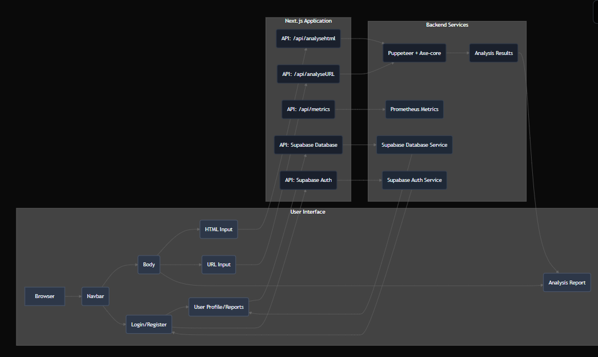

# Accessibility Analyzer

The Accessibility Analyzer is a web application designed to help developers and designers identify and rectify accessibility issues within web content. It leverages the power of `axe-core`, a leading accessibility testing engine, to provide comprehensive reports on both raw HTML snippets and live web pages.

---

## 🚀 Goals and Functionality

The primary goal of the Accessibility Analyzer is to promote inclusive web design and development by making accessibility testing straightforward and accessible.

### ✅ Core Functionality:

1. **HTML Analysis**
   - Users can paste raw HTML code directly into a text area.
   - On submission, the application analyzes the provided HTML for accessibility violations using `axe-core`.
   - **Integration:** Handled by the API endpoint [`src/app/api/analysehtml/route.jsx`](src/app/api/analysehtml/route.jsx), which uses `puppeteer` and `axe-core`.

2. **URL Analysis**
   - Users can input a URL of a live website for analysis.
   - The app fetches the page and runs accessibility checks using `axe-core`.
   - **Integration:** Managed by [`src/app/api/analyseURL/route.jsx`](src/app/api/analyseURL/route.jsx).

3. **Accessibility Reporting**
   - Reports include:
     - Summary of passes and violations.
     - Breakdown by severity: critical, serious, moderate, minor.
     - Detailed violation info: ID, description, help URL, and affected HTML nodes.
   - **Integration:** Handled by components [`src/app/component/html.jsx`](src/app/component/html.jsx) and [`src/app/component/url.jsx`](src/app/component/url.jsx).

4. **User Authentication & Report Saving**
   - Users can register/login to save reports.
   - Reports are linked to user accounts and retrievable later.
   - **Integration:**
     - Supabase handles authentication ([`src/lib/supabase.js`](src/lib/supabase.js)).
     - Saving and fetching reports is managed in [`src/lib/database.js`](src/lib/database.js).
     - UI for saved reports in [`src/app/reports/page.jsx`](src/app/reports/page.jsx).

5. **Metrics Endpoint**
   - Provides Prometheus with scrapeable metrics.
   - **Integration:** [`src/app/api/metrics/route.jsx`](src/app/api/metrics/route.jsx) exposes secured metrics.

---

## 🛠️ Technical Stack

- **Frontend:** Next.js, React, Tailwind CSS  
- **Accessibility Engine:** axe-core  
- **Browser Automation:** Puppeteer  
- **Backend/API:** Next.js API Routes  
- **Database:** Supabase (PostgreSQL)  
- **Authentication:** Supabase Auth  
- **CI/CD:** Jenkins (`jenkinsfile`)  

---

## 🏗️ Architecture Overview

---

## 📂 Repository File Structure

.
├── docker/
│   ├── Dockerfile
│   ├── docker-compose.yml
│   └── ... (other docker-related files)
├── nginx/
│   └── nginx.conf
├── src/
│   ├── app/
│   │   ├── api/
│   │   │   ├── analyseURL/
│   │   │   │   └── route.jsx
│   │   │   ├── analysehtml/
│   │   │   │   └── route.jsx
│   │   │   └── metrics/
│   │   │       └── route.jsx
│   │   ├── component/
│   │   │   ├── about.jsx
│   │   │   ├── body.jsx
│   │   │   ├── html.jsx
│   │   │   ├── navbar.jsx
│   │   │   └── url.jsx
│   │   ├── globals.css
│   │   ├── layout.js
│   │   ├── login/
│   │   │   └── page.jsx
│   │   ├── page.js
│   │   ├── register/
│   │   │   └── page.jsx
│   │   └── reports/
│   │       └── page.jsx
│   ├── components/
│   │   └── ui/
│   │       ├── button.jsx
│   │       ├── dropdown-menu.jsx
│   │       └── progress.jsx
│   ├── hooks/
│   │   └── useAuth.js
│   ├── lib/
│   │   ├── database.js
│   │   ├── postgre.sql
│   │   └── supabase.js
│   └── utils/
│       └── utils.js
├── .eslintrc.cjs
├── .gitignore
├── .next/
├── eslint.config.mjs
├── jenkinsfile
├── next.config.mjs
├── package.json
├── postcss.config.js
├── prometheus.yml
├── README.md
├── tailwind.config.js
└── tsconfig.json

### Key Files and Directories

- **Root Directory**
  - `eslint.config.mjs`: ESLint configuration, extending Next.js Web Vitals.
  - `jenkinsfile`: CI/CD pipeline definition (checkout, lint, build, push, deploy).
  - `next.config.mjs`: Next.js configuration.
  - `nginx/nginx.conf`: Reverse proxy config for Next.js and metrics security.

- **`src/app/`**
  - `api/analyseURL/route.jsx`: Analyze live site via Puppeteer + axe-core.
  - `api/analysehtml/route.jsx`: Analyze pasted HTML via Puppeteer + axe-core.
  - `api/metrics/route.jsx`: Prometheus metrics endpoint (token-secured).
  - `component/navbar.jsx`: Auth + navigation.
  - `component/body.jsx`: Switch between HTML and URL analysis.
  - `component/html.jsx`: HTML input, analysis, saving results.
  - `component/url.jsx`: URL input, analysis, saving results.
  - `component/about.jsx`: Static about section.
  - `login/page.jsx`: Login UI.
  - `register/page.jsx`: Register UI.
  - `reports/page.jsx`: Saved report viewer.
  - `page.js`: Main landing page.

- **`src/components/ui/`**
  - Prebuilt UI widgets (button, dropdown, progress).

- **`src/hooks/useAuth.js`**
  - Supabase auth state hook.

- **`src/lib/`**
  - `supabase.js`: Supabase client.
  - `database.js`: DB helpers (`saveViolationFromUrl`, `saveViolationFromHtml`, `getUserViolations`).
  - `postgre.sql`: Schema for `violations` table with RLS policies.

- **`src/utils/utils.js`**
  - General helpers.

---

## ⚙️ CI/CD Pipeline (`jenkinsfile`)

The pipeline automates build, test, and deployment:

1. **Checkout** → Clone repo.  
2. **Lint** → Run `npm run lint`.  
3. **Build Docker Image** → Includes Supabase env vars.  
4. **Push to DockerHub** → Tags `latest` + build ID.  
5. **Deploy to EC2** → Pulls repo, restarts services with `docker compose`.  

🔐 Sensitive credentials (DockerHub, Supabase, SSH keys) are stored in Jenkins credentials.

---

## 🌐 Nginx Configuration (`nginx/nginx.conf`)

Nginx acts as a **reverse proxy**:

- Routes `/` + `/api/*` → Next.js app (frontend:3000).  
- Secures `/api/metrics` with token + IP allowlist.  
- Optimized with keepalive, timeouts (600s), caching bypass, and WebSocket support.  

Integration: Docker Compose mounts config, Jenkins deploys updates.  

---

## 🎨 Frontend Components

- **Navbar**: App title + auth dropdown.  
- **Body**: Tabbed interface (HTML / URL).  
- **Textbox**: Paste + analyze HTML, show violations, allow saving.  
- **Urlbox**: Enter + analyze live URL, show violations, allow saving.  
- **About**: Project purpose + accessibility importance.  

---

## 🔑 Authentication & Database

- **Supabase.js** → Initializes Supabase client.  
- **useAuth.js** → Auth state hook.  
- **database.js** → Save + fetch violations.  
- **postgre.sql** → DB schema for `violations` with RLS enabled.  

---

## 🧩 UI Components

Prebuilt Shadcn-style UI elements:  
- `button.jsx`  
- `dropdown-menu.jsx`  
- `progress.jsx`  

---

## 📌 Best Practices

- Components designed for **reuse**.  
- **Local state** with `useState`, global auth with `useAuth` + Supabase.  
- API interaction via `fetch`, with error + loading state handling.  
- Sensitive configs in **environment variables** (never hardcoded).  
- `/api/metrics` endpoint secured with token.  

---

## ⚠️ Common Pitfalls

- **Supabase keys** must be set (`NEXT_PUBLIC_SUPABASE_URL`, `NEXT_PUBLIC_SUPABASE_ANON_KEY`).  
- Puppeteer requires `--no-sandbox` in Docker.  
- External site **rate limits** can cause failures.  
- `axe-core` version mismatches can break analysis.  
- Jenkins credentials must be configured correctly for CI/CD.  

---
This section outlines the organization of the Analyser repository, detailing the purpose of key directories and files.

